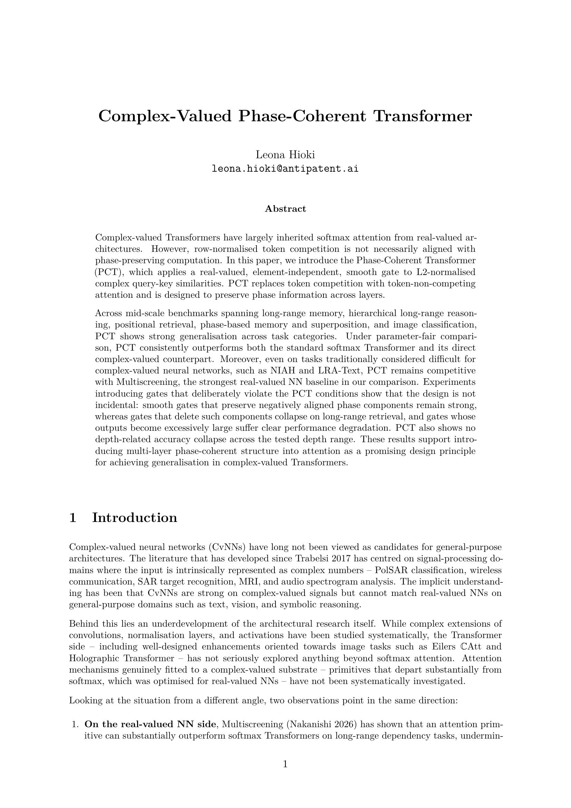

<h1 align="center">Complex-Valued Phase-Coherent Transformer</h1>

  

  📄 <a href="pct.pdf"><b>Read the paper (PDF)</b></a>

---

- [`code/`](code/) — bench reproduction code (model, data loaders, multi-task trainer, Docker recipe)
- [`result/`](result/) — per-task curated benchmark summaries
- [`lean/`](lean/) — Lean 4 formalisation of Appendix M
